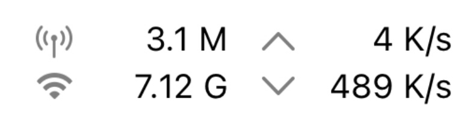

# NetworkFlows

A simple SwiftPM package reporting network traffic to you.

## Introduction



NetworkFlows provides you with all the information you need to display network traffic.

Include:

- Upload / Download Total (After Reboot): wifi, cellular, all
- Upload / Download per Second: wifi, cellular, all

Value and unit are in separate properties, so you can display them as you like.

## Usage

### With ObservedObject (SwiftUI)

1. Add the ObservedObject.

```
@ObservedObject var traffic = ObservableTrafficMonitor.observableShared
```
2. Show everything you want.
```
Text(traffic.newTrafficInfo?.trafficPerSecond.downTotal.humanReadableNumber ?? "--")
+
Text(" ")
+
Text(traffic.newTrafficInfo?.trafficPerSecond.downTotal.humanReadableNumberUnit ?? "--")
```
It should look like: ``` 100 KB/s ```.

### With Delegate

1. Conform to TrafficMonitorDelegate.
```
func trafficMonitor(updatedInfo: TrafficInfo) {
    let number = updatedInfo.trafficPerSecond.downTotal.humanReadableNumber
    let unit = updatedInfo.trafficPerSecond.downTotal.humanReadableNumberUnit
    print(number + " " + unit)
}
```
2. Set the delegate to self.

```
TrafficMonitor.shared.delegate = self
```

That's it! Check out the demo app for more information.

### Result Struct
```
TrafficInfo
├── totalTraffic: TrafficInfoPack
└── trafficPerSecond: TrafficInfoPack

TrafficInfoPack
├── cellularDown: TrafficInfoItem
├── cellularTotal: TrafficInfoItem
├── wifiUp: TrafficInfoItem
├── wifiDown: TrafficInfoItem
├── wifiTotal: TrafficInfoItem
├── upTotal: TrafficInfoItem
└── downTotal: TrafficInfoItem

TrafficInfoItem
├── byteCount: Int // Number count in bytes.
├── humanReadableNumber: String // "100.5"
└── humanReadableNumberUnit: String // "MB"
```
